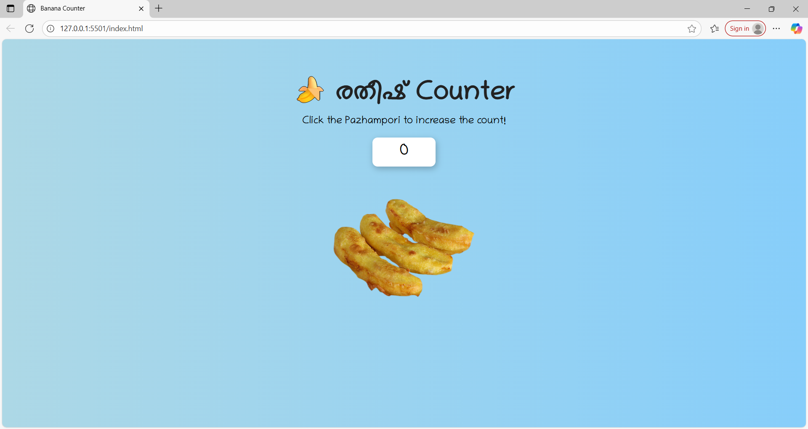

# [Pazhampori Counter] 🎯

## Basic Details
### Team Name: [Nomu]

### Team Members
- Team Lead: [Kelna] - [AISAT]
- Member 2: [Jeeva] - [AISAT]

### Project Description
[PazhamPori Counter is a fun, food-themed click counter built using HTML, CSS, and JavaScript. The goal of this project is to learn and practice basic web development skills while making something light-hearted and culturally familiar.]

### The Problem (that doesn't exist)
[“How do we track the number of PazhamPoris we've eaten without eating them?”

This project solves the totally unnecessary but deeply satisfying need to count imaginary PazhamPoris just by clicking a button. No real calories involved — just pure digital joy."

]

### The Solution (that nobody asked for)
[A shiny button that goes click and adds one more PazhamPori to your imaginary plate 🍌🔥
With stylish fonts and sweet colors, it’s the only tool you’ll ever need to feel productive without doing anything useful.
Built using just HTML, CSS, and JavaScript — because who needs frameworks when you're counting fritters?]

## Technical Details
### Technologies/Components Used
For Software:
- [HTML,Javascript,CSS]
- [Libraries used]
- [GPT]

For Hardware:
- [Laptop,Mobile phone]

### Implementation
For Software:
# Installation
[commands]

# Run
[commands]

### Project Documentation
For Software:

# Screenshots (Add at least 3)

# Diagrams

*Add caption explaining your workflow*

For Hardware:

# Schematic & Circuit

*Add caption explaining connections*

*Add caption explaining the schematic*

# Build Photos

*List out all components shown*

*Explain the build steps*

*Explain the final build*

### Project Demo
# Video
## 📺 Demo Video

[Watch the demo on Google Drive](https://drive.google.com/file/d/12PWFoDIgHE23woMTEyjQnjmQEdCzXe-G/view?usp=drivesdk)

*Explain what the video demonstrates*

# Additional Demos
[Add any extra demo materials/links]

## Team Contributions
- [Jeeva]: [Idea and design]
- [Name 2]: [Specific contributions]
- [Name 3]: [Specific contributions]

---
Made with ❤️ at TinkerHub Useless Projects 

